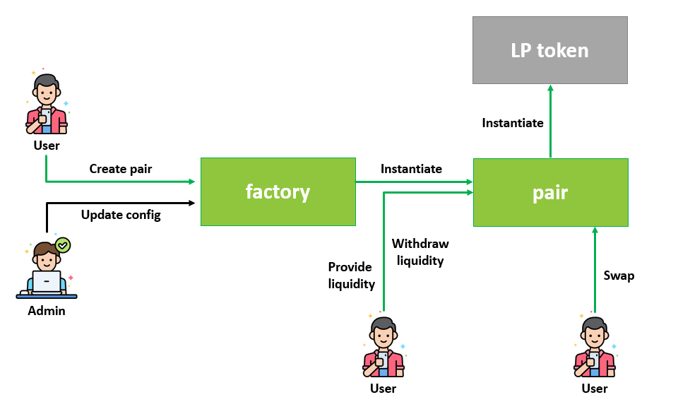

# Damn Vulnerable AMM (DVAMM)
## Background
In a distant time, some alien developers helped earthlings to build a simple but functional AMM protocol for Terra blockchain. Everything was working as expected and humans were able to easily swap their tokens at their convenience.

However, there was a detail that was not considered: Aliens do not know about cybersecurity! Now it is your mission to discover all vulnerabilities that affect this protocol before the evil army of Adverse Life Forms (A.L.F) can attack.

Welcome to Damn Vulnerable AMM (DVAMM), where the devil is in the details and nothing is as it seems... 

P.S.: Happy hacking!

## Scope
CosmWasm smart contracts inside `contracts` folder: `factory` and `pair`. 

## Setup for testing

### Prerequisites
You will need Rust 1.78.0 with wasm32-unknown-unknown target installed:
```sh
rustup target add wasm32-unknown-unknown
```
In addition, you will need to have `NodeJS v.18`, `Docker` and `Docker-compose` installed.  

It is recommended to have `terrad` installed as well, if you want to communicate with LocalTerra blockchain using the CLI.

### Compiling
In the `scripts` folder, execute the following command to obtain the optimized compilation from contracts:
```sh
npm run build-artifacts
```
It may need superuser permissions, depending on your docker installation.  

### Deploying
To deploy the binaries to LocalTerra and run the initialization script, go to `scripts` folder and execute the following commands:
```sh
npm install
npm start
```
It may need superuser permissions, depending on your docker installation.  

### Reset environment
To reset localterra environment, go to `scripts` folder and execute: 
```sh
npm run reset-localterra
```
It may need superuser permissions, depending on your docker installation.  

## General dataflow
Below is a general dataflow for the AMM protocol:
