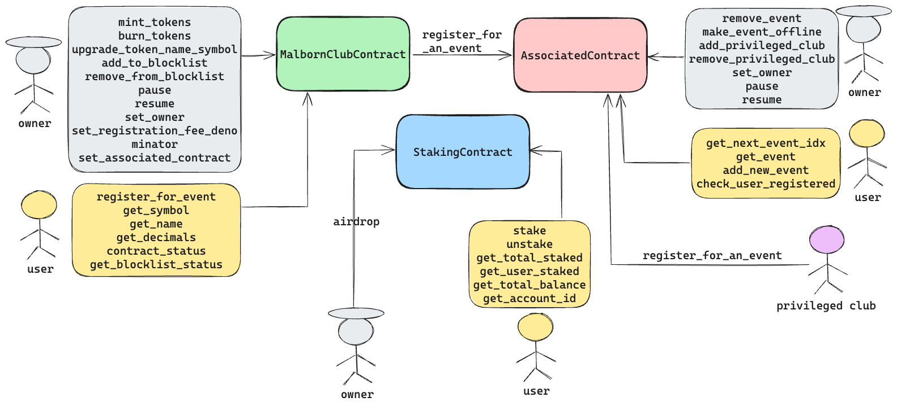

# NEAR CTF

A smart contract build for the NEAR blockchain. It is a contract from the Malborn Club, which will be a DAO for the elite members of the Malborn Club. Not all functionalities are implemented, but we have our own token and implement an interaction with an associated contract for event registration.

## Scope

All folders in this repository are in the scope

## Building

```bash
cargo build --release
```

## Testing

```bash
cargo test
```

## Deploying

You can use the `deployer.sh` scripts present in each contract directory to deploy the contract to the testnet. Just update owner_id to account id if you want to set as the owner.

## General dataflow

Below is a general dataflow for the protocol:
